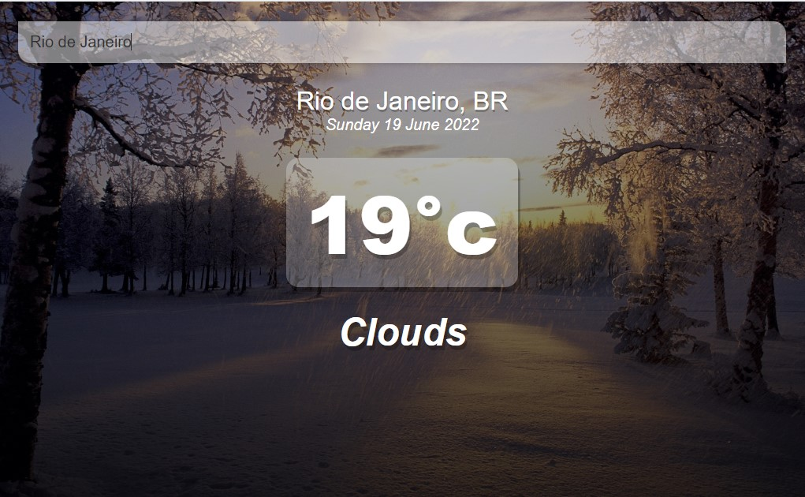

<h1 align="center">
  Vue Weather
</h1>

  <a href="#-tech">Techs</a>&nbsp;&nbsp;&nbsp;|&nbsp;&nbsp;&nbsp;
  <a href="#-project">Project</a>&nbsp;&nbsp;&nbsp;|&nbsp;&nbsp;&nbsp;
  <a href="#-considerations">Considerations</a>&nbsp;&nbsp;&nbsp;|&nbsp;&nbsp;&nbsp;
  <a href="#memo-license">License</a>

  

 

## 🚀 Tech

This project was developed with the following techs:

- HTML
- CSS
- VueJS
- OpenWeatherMap API

## 💻 Project

VueWeather is a application based on the weather of determined city

## :memo: License

This project is under the license of MIT. See the [LICENSE](.github/LICENSE.md) file for more details.

---

## Start and Make your changes
 Use *npm install* for download all the dependencies
 # Or
 Use *yarn add* for download all the dependencies
 
 ## Start the app
 Use *npm run serve*
 # Or
 Use *yarn serve*
 
 ## ❤️ Considerations
 My first project Vue-Based so...
 
 Simple Vue-based app that returns the weather of the searched location.
 
Feito com ♥ by DevDuque :wave: [ContactMe!](https://www.linkedin.com/in/davih-duque-787b901a4/)
 
 

